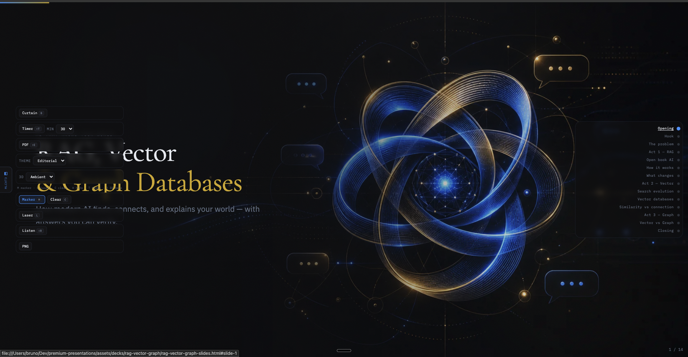
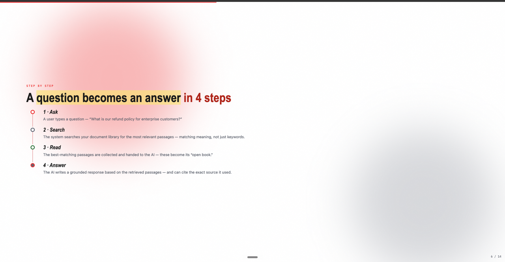
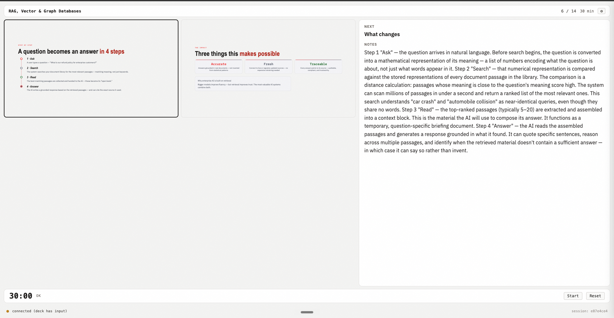

# Premium Presentations

Claude skill for generating polished, browser-rendered HTML presentation decks.

This repo is the Claude Code plugin package and the skill source. `SKILL.md` is the agent entry point; `README.md` is human-facing orientation only.

## What You Get

- **Portable HTML decks:** generated decks bundle runtime CSS/JS, theme assets,
  search, diagrams, presenter mode, export helpers, and interaction controls
  without CDN or remote-font dependencies.
- **Presenter workflow:** press `Shift+P` to open the presenter popup with
  current/next slide previews, speaker notes, a slide timeline, rehearsal mode,
  a teleprompter/distance-reading mode, timer controls, and a slide rail.
- **Rehearsal tools:** the presenter timeline shows planned per-slide time from
  the active timer, tracks actual dwell time while rehearsing, lets speakers
  jump directly to any slide, and persists rehearsal history (last 10 runs per
  deck) with per-slide suggested budgets and a JSON export.
- **Visual Design Power:** the Studio and runtime expose theme composition,
  layout variants, reusable design-power components, density checks, motion
  profiles, data visualization blocks, visual-asset audits, and a theme
  generator that turns a hex brand palette into a new theme behind a WCAG
  contrast gate.
- **Speaker controls:** decks include keyboard/touch navigation, Cmd+K search,
  annotations, laser pointer, curtain mode, TTS read-aloud, WebHID clicker
  support, 3D modes, Mermaid/diagram helpers, PNG/OG-cover export, PDF export,
  Markdown speaker-notes handouts, and LAN follow-along for the audience.
- **Validation tooling:** deterministic scripts scaffold, bundle, validate,
  and smoke-test decks and the shared runtime contract, gated by `deck_doctor.py`
  (structure, layout, diagrams, runtime contract, and WCAG contrast in one report).
- **PR-to-deck:** the `/present-pr` plugin command turns the current branch's
  diff into a `deck_doctor`-validated deck grounded in the real `git diff`.

A full worked example — a 20-slide deck with a generated cover, PDF, and
speaker-notes handout already checked in — lives at
`skills/premium-presentations/assets/examples/rag-vector-graph/`.

## Preview

**Title slide** — Editorial dark theme with ambient 3D visual, slide rail, and tool panel:



**Content slide** — Cupertino light theme with pipeline step layout:



**Presenter view** — Dual-pane popup with current/next slide preview, expanded speaker notes, presenter timeline, rehearsal mode, and a configurable countdown timer (set any duration from the tool panel, or define a default in deck settings):



## Install

### Claude Code plugin (recommended)

Add to `~/.claude/settings.json`:

```json
{
  "extraKnownMarketplaces": {
    "premium-presentations": {
      "source": { "source": "github", "repo": "bruno-rv/premium-presentations" }
    }
  },
  "enabledPlugins": {
    "premium-presentations@premium-presentations": true
  }
}
```

### Manual

Clone the repo and link the skill subdirectory:

```bash
git clone https://github.com/bruno-rv/premium-presentations.git
mkdir -p ~/.claude/skills
ln -s "$(pwd)/premium-presentations/skills/premium-presentations" ~/.claude/skills/premium-presentations
```

For local validation scripts that use Node dependencies:

```bash
npm --prefix skills/premium-presentations/scripts ci
```

For browser-rendering checks, install the Python validation dependency and its
managed Chromium once (this Chromium also powers `og_cover.py`, `export_pdf.py`,
and layout validation):

```bash
python3 -m pip install -r skills/premium-presentations/scripts/requirements.txt
python3 -m playwright install chromium
```

## Use

List available themes:

```bash
./skills/premium-presentations/scripts/list-themes.py
```

Create a deck:

```bash
./skills/premium-presentations/scripts/new-deck.sh warm my-talk "My Title" 12
```

The generated deck is written to:

```text
skills/premium-presentations/assets/decks/my-talk/my-talk-slides.html
```

Validate it — `deck_doctor.py` chains every validator (structure, layout,
diagrams, runtime contract, WCAG contrast) into one health report:

```bash
python3 skills/premium-presentations/scripts/deck_doctor.py \
  skills/premium-presentations/assets/decks/my-talk/my-talk-slides.html \
  skills/premium-presentations/assets/decks/my-talk/my-talk-slide-spec.md
```

Generate distribution artifacts next to the deck — a social/cover image, a
PDF, and a Markdown speaker-notes handout:

```bash
python3 skills/premium-presentations/scripts/og_cover.py \
  skills/premium-presentations/assets/decks/my-talk/my-talk-slides.html
python3 skills/premium-presentations/scripts/export_pdf.py \
  skills/premium-presentations/assets/decks/my-talk/my-talk-slides.html
python3 skills/premium-presentations/scripts/export_handout.py \
  skills/premium-presentations/assets/decks/my-talk/my-talk-slides.html
```

Each writes a sidecar file (`og-cover.png`, `my-talk.pdf`, `my-talk-handout.md`)
next to the deck. The standalone deck HTML does not reference them automatically.

Open the studio:

```bash
open skills/premium-presentations/assets/studio/index.html
```

The Studio includes a Design Lab for theme composition, layout/component
snippets, density checks, motion profiles, data visualizations, and visual
asset audits. A three-slide feature preview lives at:

```text
skills/premium-presentations/assets/templates/preview-design-power.html
```

Use presenter mode:

```text
Shift+P  open presenter popup
R        start/pause/resume rehearsal in the popup
Shift+R  clear rehearsal timings
G        open/close the popup slide rail
M        toggle teleprompter (distance-reading) mode
P        start/pause teleprompter auto-scroll
[ / ]    slow down / speed up auto-scroll
```

The presenter popup is local to the speaker. Audience slides stay focused on
the deck content while the popup handles notes, current/next previews, timeline
jumps, rehearsal timing, and timer settings.

## Layout

```text
premium-presentations/          ← repo root
├── .claude-plugin/
│   ├── plugin.json
│   └── marketplace.json
├── docs/                       ← screenshots for this README
├── skills/
│   └── premium-presentations/  ← skill root (SKILL.md entry point)
│       ├── SKILL.md
│       ├── assets/
│       │   ├── shared/         ← runtime CSS/JS, theme visuals
│       │   ├── studio/
│       │   └── templates/
│       ├── references/
│       └── scripts/
├── LICENSE
└── README.md
```

`assets/` contains bundled resources used by generated output: runtime CSS/JS,
theme visuals, templates, snippets, and the studio page. Generated decks are
portable standalone HTML bundles: runtime search, diagrams, PNG export,
presenter mode, design-power components, controls, and theme assets do not
require CDNs or remote fonts.
The key committed paths are `assets/shared/`, `assets/studio/`, and
`assets/templates/`.

`assets/decks/` is generated output from `scripts/new-deck.sh`. It is ignored
by git and should stay out of the package unless a user explicitly asks to
commit a finished deck.

`references/` contains one-level agent guidance loaded only when needed:
runtime details, design rules, component patterns, examples, theme notes, and
the slide-spec template.

`scripts/` contains deterministic tooling for scaffolding, bundling, and
validation. Its test suite lives in `scripts/tests/`.

## Validate The Skill

These commands test the skill package itself (deck-output validation lives in
`SKILL.md`):

```bash
python3 skills/premium-presentations/scripts/tests/test_skill_layout.py
python3 skills/premium-presentations/scripts/tests/test_runtime_contract.py
python3 skills/premium-presentations/scripts/tests/test_design_power_contract.py
python3 skills/premium-presentations/scripts/validate_runtime_contract.py
npm --prefix skills/premium-presentations/scripts test
npm --prefix skills/premium-presentations/scripts run test:presenter
npm --prefix skills/premium-presentations/scripts run test:popup
git diff --check
```

Create and validate a smoke deck:

```bash
./skills/premium-presentations/scripts/new-deck.sh editorial smoke-deck "Smoke Deck" 2
python3 skills/premium-presentations/scripts/deck_doctor.py \
  skills/premium-presentations/assets/decks/smoke-deck/smoke-deck-slides.html
rm -rf skills/premium-presentations/assets/decks/smoke-deck
```
